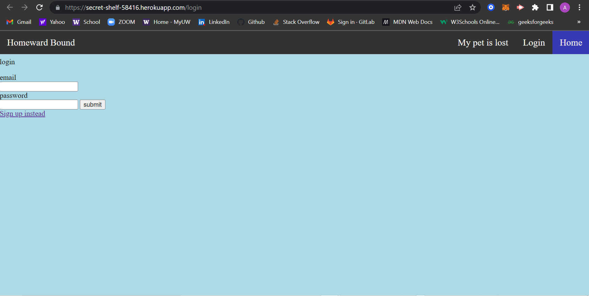

# HOMEWARD BOUND

## Description 

We made this website because we wanted a user friendly site that was able to help people look for their missing pets. By logging, in you are able to search in our database (and King County) to see where any missing reported pets have been. Also by logging in, you are able to add your own pet to the database so others are able to keep an eye out in the King County area.  

## Homepage image:

## User Story
As a user I want to look for found pets in King county and post a missing pet do others are able to see what I posted. 

* `WHEN` the user goes the homepage
* `THEN` they are prompted to either LOGIN or SIGN Up
* `WHEN` the user clicks sign up, they are taken to the sign up page and prompted to enter 
<!-- * *Add a then** -->
their data. Or if they are already signup they use their login information.
* `WHEN` the user signs in, they are able to see the found pets in King county
* `THEN` they can scroll though the found pets in the area
* `WHEN` the user wants to post a new lost pet, tyey click on My pet is lost.
* `THEN` they will be prompted to fill out the form with the pets name, a description, last seen, the area(zipcode) they were last seen, Breed of animal, and contact information.

## Installations dependencies:
* npm install `bcrypt`
* npm install `express`
* npm install `express-sessions`
* npm install `express-handlebars`
* npm install `sequelize`
* npm install `mysql2`
* npm install `dotenv`
* npm install `node-emoji`

### Links to deployed site and Github:
* [Deployed Heroku site](https://secret-shelf-58416.herokuapp.com/)
* [Git Repository](https://github.com/bburton5/homeward-bound)

- Google Doc: https://docs.google.com/document/d/1qcI-zFQWMMhXyoOIFpnMIpgOaaMMFAWef-j_jYiVvfY/edit#

- Trying to push to heroku
